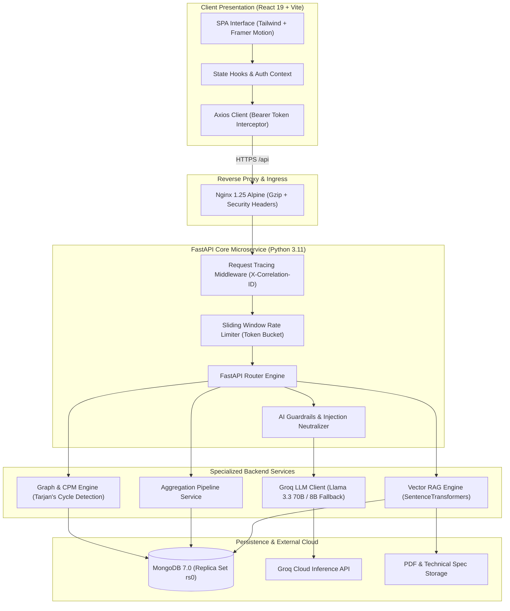

# TaskPilot 🚀

[](https://fastapi.tiangolo.com)
[](https://react.dev)
[](https://www.typescriptlang.org)
[](https://www.mongodb.com)
[](https://groq.com)
[](https://www.docker.com)
[](LICENSE)

> **Next-Generation AI Project & Task Management Platform**  
> Engineered for agile teams, technical leads, and engineering managers. TaskPilot integrates sub-second Llama 3.3 70B inference via Groq Cloud, topological dependency cycle detection, Critical Path Method (CPM) analytics, and dense vector document retrieval (RAG) into a sleek, dark-mode glassmorphic workspace.

---

## 📑 Table of Contents
- [System Architecture](#-system-architecture)
- [Feature Matrix](#-feature-matrix)
- [Tech Stack](#-tech-stack)
- [Getting Started](#-getting-started)
  - [Prerequisites](#prerequisites)
  - [Quickstart with Docker Compose](#option-a-instant-docker-compose-recommended)
  - [Manual Local Setup (Backend + Frontend)](#option-b-manual-local-development)
- [API Documentation Reference](#-api-documentation-reference)
- [Security & Governance](#-security--governance)
- [Video Demo & Launch Materials](#-video-demo--launch-materials)
- [Contributing & License](#-contributing--license)

---

## 🏛 System Architecture



---

## ⚡ Feature Matrix

| Feature Domain | Capabilities | Technologies Used |
| :--- | :--- | :--- |
| **Core Project & Task Management** | • Hierarchical projects with milestones, tags, and progress tracking<br>• Interactive drag-and-drop Kanban board (TODO, IN_PROGRESS, IN_REVIEW, COMPLETED, BLOCKED)<br>• Granular subtasks, comment threads, attachments, and dynamic task filtering | FastAPI, Motor, React 19, Lucide Icons |
| **AI Project Decomposition** | • Natural language prompt to full project plan with milestones and dependencies<br>• Automated 5–10 task generation with difficulty and time estimates<br>• Intelligent task prioritization and meeting notes action item extraction | Groq Cloud, Llama 3.3 70B Versatile, Pydantic v2 |
| **Dependency Graph & CPM** | • Directed Acyclic Graph (DAG) serialization<br>• 3-color DFS topological cycle detection preventing deadlocks (`400 Bad Request`)<br>• Dynamic Programming Critical Path Method (CPM) computation with animated path glow<br>• Completion guard blocking task resolution until prerequisites complete | Topological Sorting, Tarjan's DFS, SVG Visualizer |
| **Document RAG Knowledge Base** | • PDF and TXT document ingestion with recursive text chunking (~800 chars, 150 overlap)<br>• Dense vector semantic embeddings<br>• Cosine similarity nearest neighbor retrieval<br>• Synthesis with exact source chunk citations | PyPDF, Sentence-Transformers, Motor, Groq |
| **AI Risk Detection Engine** | • Real-time project risk scanner (bottlenecks, deadline slippage, member overload)<br>• Composite 0–100 risk score calculation (LOW, MEDIUM, HIGH, CRITICAL)<br>• Context-aware interactive Project Copilot chat with live project state injection | Groq LLM, Sliding Window Rate Limiter |
| **Executive Analytics & Health** | • Single-roundtrip `$facet` MongoDB aggregation pipelines<br>• Weighted Project Health Gauge: `(Completion×0.4)+(OnTime×0.3)+(Unblocked×0.2)+(Activity×0.1)`<br>• Cumulative Flow Diagrams (CFD), workload distribution, and milestone horizons | Recharts, MongoDB Aggregations |
| **Enterprise Security & Telemetry** | • Passlib Bcrypt password hashing & JWT HS256 tokens<br>• Sliding window IP & user rate limiting with Groq 429 exponential backoff<br>• AI prompt injection scanner and daily token quota governance (50k tokens/day)<br>• Structured single-line JSON logging with `X-Correlation-ID` tracing | Pydantic Settings, Slowapi logic, Contextvars |

---

## 🛠 Tech Stack

### Frontend
- **Framework**: React 19 (TypeScript 5.6)
- **Bundler & Tooling**: Vite 8, PostCSS, Tailwind CSS
- **Animations & Visualizations**: Framer Motion, Recharts, Custom SVG DAG Visualizer
- **Icons & UI Utilities**: Lucide React, Axios, date-fns

### Backend
- **Framework**: FastAPI (Python 3.11 / 3.12)
- **ASGI Server**: Gunicorn with Uvicorn worker class (`uvicorn.workers.UvicornWorker`)
- **Database Driver**: Motor 3.5+ (Async MongoDB driver)
- **Data Validation & Settings**: Pydantic v2, `pydantic-settings`
- **Machine Learning & NLP**: `groq`, `sentence-transformers`, `pypdf`
- **Security & Authentication**: `python-jose[cryptography]`, `passlib[bcrypt]`

---

## 🚀 Getting Started

### Prerequisites
- **Node.js**: `v20.x` or later
- **Python**: `v3.11` or `v3.12`
- **MongoDB**: `v7.0+` (local instance or MongoDB Atlas cluster)
- **Groq API Key**: Free tier available at [console.groq.com/keys](https://console.groq.com/keys)
- **Docker & Docker Compose**: (Optional, for containerized execution)

---

### Option A: Instant Docker Compose (Recommended)

Run the entire platform (Frontend + Backend + MongoDB Replica Set) with a single command:

```bash
# 1. Clone repository
git clone https://github.com/your-username/taskpilot.git
cd taskpilot

# 2. Export your Groq API key
export GROQ_API_KEY="gsk_your_groq_api_key_here"  # Linux/macOS
$env:GROQ_API_KEY="gsk_your_groq_api_key_here"    # Windows PowerShell

# 3. Spin up full-stack containers
docker compose up --build -d

# 4. Monitor startup logs
docker compose logs -f backend
```

- **Frontend Application**: [http://localhost](http://localhost) (or [http://localhost:3000](http://localhost:3000))
- **Backend Swagger API**: [http://localhost:8000/docs](http://localhost:8000/docs)
- **System Health Endpoint**: [http://localhost:8000/api/health](http://localhost:8000/api/health)

---

### Option B: Manual Local Development

#### 1. Backend Setup

```bash
cd backend

# Create & activate Python virtual environment
python -m venv venv
# Linux/macOS:
source venv/bin/activate
# Windows PowerShell:
.\venv\Scripts\Activate.ps1

# Install dependencies
pip install --upgrade pip
pip install -r requirements.txt

# Initialize environment configuration
cp .env.example .env

# Generate secure JWT secret and update .env
python -c "import secrets; print(secrets.token_hex(32))"

# Validate database readiness before boot
python scripts/validate_db.py --uri "mongodb://localhost:27017" --db-name "taskpilot_db"

# Start development server
uvicorn app.main:app --reload --host 0.0.0.0 --port 8000
```

#### 2. Frontend Setup

```bash
cd ../frontend

# Install npm dependencies
npm install

# Initialize environment configuration
cp .env.example .env

# Start Vite dev server
npm run dev
```

Visit [http://localhost:5173](http://localhost:5173) to access the interactive web application.

---

## 📡 API Documentation Reference

### Core Endpoints

| Method | Endpoint | Description | Auth Required |
| :--- | :--- | :--- | :---: |
| `POST` | `/api/auth/register` | Register new user account and receive JWT tokens | No |
| `POST` | `/api/auth/login` | Authenticate user and return access & refresh tokens | No |
| `GET` | `/api/projects` | List projects with status filtering & pagination | Yes |
| `POST` | `/api/projects` | Create a new project with milestones and tags | Yes |
| `GET` | `/api/projects/{id}/dependency-graph` | Topological DAG with Critical Path calculations | Yes |
| `GET` | `/api/projects/{id}/health` | Project health index & delivery risk score | Yes |
| `POST` | `/api/tasks/{id}/dependencies` | Add prerequisite dependency with cycle detection | Yes |
| `POST` | `/api/ai/project-plan` | Decompose project prompt into milestones and tasks | Yes |
| `POST` | `/api/ai/risk-analysis` | Scan project telemetry for bottlenecks & overload | Yes |
| `POST` | `/api/documents/upload` | Ingest PDF/TXT doc with text chunking & embedding | Yes |
| `POST` | `/api/rag/query` | Vector search across documentation with Groq answer | Yes |
| `GET` | `/api/health` | Deep system healthcheck (MongoDB latency & state) | No |

---

### Example Payloads

#### 1. Topological Graph & Critical Path (`GET /api/projects/{id}/dependency-graph`)
```json
{
  "project_id": "65f2a1b9e1b2c3d4e5f6a7b8",
  "nodes": [
    {
      "task_id": "task_01",
      "title": "Design Database Schema",
      "status": "COMPLETED",
      "priority": "HIGH",
      "assignee_name": "Sarah Chen",
      "duration_days": 3
    },
    {
      "task_id": "task_02",
      "title": "Implement JWT Auth Service",
      "status": "IN_PROGRESS",
      "priority": "CRITICAL",
      "assignee_name": "Alex Rivera",
      "duration_days": 4
    }
  ],
  "edges": [
    {
      "source": "task_01",
      "target": "task_02",
      "is_critical_path": true
    }
  ],
  "critical_path": ["task_01", "task_02"],
  "total_duration_days": 7
}
```

#### 2. AI Document RAG Synthesis (`POST /api/rag/query`)
**Request:**
```json
{
  "project_id": "65f2a1b9e1b2c3d4e5f6a7b8",
  "question": "What is the token expiration policy and rate limit threshold?"
}
```
**Response:**
```json
{
  "answer": "According to the Architecture Specification (Section 4.2), access tokens expire after 24 hours (1440 minutes), while refresh tokens remain valid for 7 days. AI endpoints enforce a sliding window rate limit of 30 requests per minute per user.",
  "confidence": 0.94,
  "sources": [
    {
      "document_id": "doc_88a1b2",
      "filename": "TaskPilot_Security_Arch_v1.2.pdf",
      "chunk_index": 4,
      "similarity_score": 0.892
    }
  ]
}
```

---

## 🔒 Security & Governance

- **Zero Secret Commits**: `.env` and `.env.local` files are enforced in `.gitignore` across all subfolders.
- **Pydantic Validation**: All environment variables and AI outputs are validated against strict Pydantic schemas.
- **Prompt Injection Defense**: Multi-pattern regex sanitizer neutralizes instruction overrides and unauthorized system prompts.
- **Rate Limiting & Quotas**: Sliding window rate limits (30 req/min) and daily token ceiling (50,000 tokens/day) prevent API exhaustion and runaway billing.
- **Least Privilege Docker**: Containers run as non-root user `appuser` (UID `10001`).

---

## 🎥 Video Demo & Launch Materials

- **5-Minute Video Walkthrough Script**: Detailed in [docs/DEMO_SCRIPT.md](file:///c:/Users/prade/OneDrive/Desktop/Tharun/full_stack/docs/DEMO_SCRIPT.md)
- **LinkedIn & Social Media Launch Kit**: Detailed in [docs/LAUNCH_MATERIALS.md](file:///c:/Users/prade/OneDrive/Desktop/Tharun/full_stack/docs/LAUNCH_MATERIALS.md)
- **Production Cloud Deployment Playbook**: Detailed in [docs/DEPLOYMENT.md](file:///c:/Users/prade/OneDrive/Desktop/Tharun/full_stack/docs/DEPLOYMENT.md)
- **Cloud Blueprints & Manifests**: Found in [deploy/](file:///c:/Users/prade/OneDrive/Desktop/Tharun/full_stack/deploy/) (`render.yaml`, `railway.json`)


---

## 📄 Contributing & License

Contributions are welcome! Please submit a pull request or open an issue for feature requests.

Distributed under the **MIT License**. See `LICENSE` for details.
